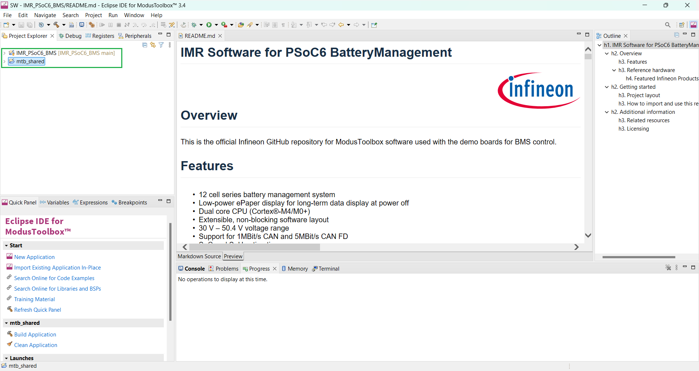
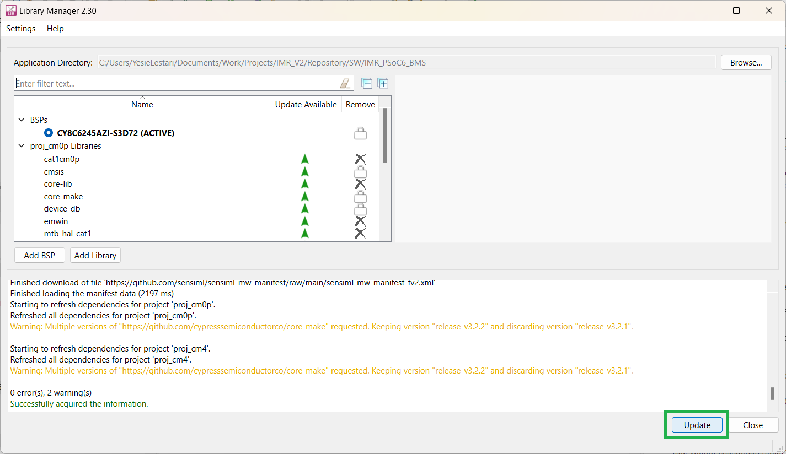
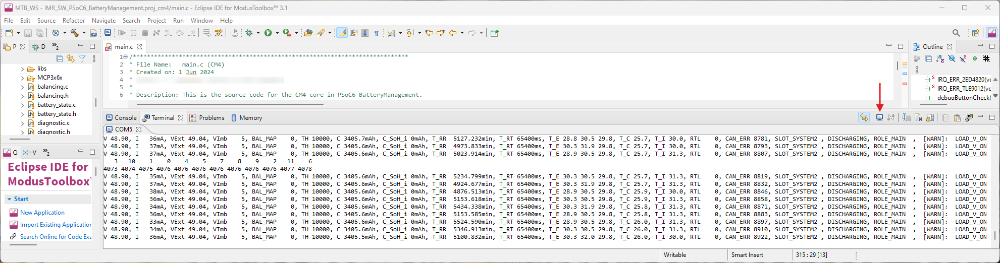

<!--
SPDX-FileCopyrightText: Copyright (c) 2024 Infineon Technologies AG
SPDX-License-Identifier: MIT
-->

# IMR Software for PSoC6 Battery Management

<a href="https://www.infineon.com">

</a>
<br>
<br>

## Overview

<p>This is the official Infineon GitHub repository for ModusToolbox™ software used with the demo boards for BMS control.</p>

### Features

- 12 cells in series battery management system (BMS)
- Low-power e-Paper display for long-term data display at power off
- Dual core CPU (Arm® Cortex®-M4/M0+)
- Extensible, non-blocking software layout
- 30 V – 50.4 V voltage range
- Support for 1 Mbit/s CAN and 5 Mbit/s CAN FD
- SoC and SoH estimation
- Balancing algorithm
- Precharge algorithm
- Hot-plug support
- Real-time data recording
- Extensive diagnostic system 
- Current, voltage and temperature threshold errors
- Open load diagnostics error monitoring
- Cell overvoltage or undervoltage check
- Balancing over- and undercurrent errors
- ADC cross-check error
- Internal overtemperature detection
- Register CRC check fault detection
- Internal peripheral error checks
- 16-bit measurement of voltages and current
- Five temperature measurement channels
- Low-power Flash technology
- Programmable digital & analog resources
- Integrated buzzer

### Reference hardware

This software is meant to run on following reference hardware:
- [DEMO_IMR_BMSPWR_V1 - Demo board for BMS power](https://www.infineon.com/cms/en/product/evaluation-boards/demo_imr_bmspwr_v1/)
- [DEMO_IMR_BMSCTRL_V1 - Demo board for BMS control](https://www.infineon.com/cms/en/product/evaluation-boards/demo_imr_bmsctrl_v1/)

The system consists of a power board on which all measurement and power hardware is populated and an exchangeable main controller board.

#### Featured Infineon Products 
<p>Following products are featured by the reference hardware:
<br>
<br>
<table style="width:100%">
  <tr>
    <th>Product</th>
    <th>Description</th>
  </tr>
  <tr>
    <td><a href="https://www.infineon.com/cms/en/product/microcontroller/32-bit-psoc-arm-cortex-microcontroller/psoc-6-32-bit-arm-cortex-m4-mcu/cy8c6245azi-s3d72/">CY8C6245AZI-S3D72</a></td>
    <td>High-performance, low-power dual-core microcontroller</td>
  </tr>
  <tr>
    <td><a href="https://www.infineon.com/cms/en/product/power/gate-driver-ics/automotive-gate-driver-ics/2ed4820-em/">2ED4820-EM</a></td>
    <td>48 V smart high-side MOSFET gate driver</td>
  </tr>
  <tr>
    <td><a href="https://www.infineon.com/cms/en/product/battery-management-ics/tle9012dqu/">TLE9012DQU</a></td>
    <td>Li-Ion battery monitoring and balancing analog frontend IC</td>
  </tr>
  <tr>
    <td><a href="https://www.infineon.com/cms/en/product/power/lighting-ics/dc-dc-led-driver-ic/ild8150/">ILD8150</a></td>
    <td>High power 80V DC-DC converter IC</td>
  </tr>
  <tr>
    <td><a href="https://www.infineon.com/cms/en/product/power/mosfet/n-channel/ipt010n08nm5/">IPT010N08NM5</a></td>
    <td>Single N-Channel OptiMOS™ 5 power MOSFET</td>
  </tr>
  <tr>
    <td><a href="https://www.infineon.com/cms/en/product/transceivers/automotive-transceiver/automotive-can-transceivers/tle9351bvsj/">TLE9351BVSJ</a></td>
    <td>High speed CAN Transceiver for CAN and CAN-FD</td>
  </tr>
  <tr>
    <td><a href="https://www.infineon.com/cms/en/product/sensor/current-sensors/tli4971-a025t5-e0001/">TLI4971-A025T5-E0001</a></td>
    <td>Magnetic coreless current sensor with analog interface</td>
  </tr>
  <tr>
    <td><a href="https://www.infineon.com/cms/en/product/power/power-supply-ics/linear-voltage-regulators-for-automotive-applications/tls205b0ej-v33/">TLS205B0EJ V33</a></td>
    <td>Micro power, low noise low dropout voltage regulator with current output up to 500 mA</td>
  </tr>
  <tr>
    <td><a href="https://www.infineon.com/cms/en/product/power/linear-voltage-regulator/linear-voltage-regulators-for-automotive-applications/tls208d1ejv/">TLS208D1EJV</a></td>
    <td>Linear Voltage Post Regulator, Low Dropout, Low Noise, adjustable</td>
  </tr>
  <tr>
    <td><a href="https://www.infineon.com/cms/en/product/power/mosfet/small-signal-small-power/bsd235n/">BSD235N</a></td>
    <td>OptiMOS™ 2 N-Channel Small Signal MOSFET</td>
  </tr>
  <tr>
    <td><a href="https://www.infineon.com/cms/en/product/power/mosfet/p-channel/irlml6401/">IRLML6401TRPBF</a></td>
    <td>12 V Single P-Channel Power MOSFET</td>
  </tr>
  <tr>
    <td><a href="https://www.infineon.com/cms/en/product/power/mosfet/n-channel/isc035n10nm5lf2/">ISC035N10NM5LF2</a></td>
    <td>OptiMOS™ 5 Single N-Channel Linear FET</td>
  </tr>
  <tr>
    <td><a href="https://www.infineon.com/cms/en/product/memories/f-ram-ferroelectric-ram/cy15b256q-sxa/">CY15B256Q-SXA</a></td>
    <td>256-Kbit Automotive Serial (SPI) F-RAM</td>
  </tr>
</table>
</p>
<br>

## Getting started

### Project layout

This ModusToolbox project is split up into 2 subprojects, one for each processor:

```text
├── proj_cm4/                             # Sub-project for the main processor (main BMS functions)
|    ├── BMS_2ED4820EM/                   # Library for the safety switch of (intelligent gate driver)
|    ├── BMS_TLE9012/                     # Library for the analog frontend
|    ├── FRAM_DIRECT_SPI.c/               # Library for the FRAM memory IC
|    ├── main.c                           # Main code file for the main processor (main BMS functions)
|    ├── balancing.h/.c                   # Abstraction of battery balancing related functions 
|    ├── battery_state.h/.c               # Abstraction of battery state related algorithm (e.g. SoC & SoH)
|    ├── diagnostic.h/.c                  # Diagnostic subsystem
|    ├── global_management.h/.c           # Common elements between all components on CM4 core
|    ├── IMR_CAN.h/.c                     # CAN Communication (BMS specific)
|    ├── IMR_CAN_GLOBAL.h                 # Global definitions and IDs for CAN communication within IMR
|    ├── memory.h/.c                      # Abstraction of memory subsystem used for status and real-time data storage
|    ├── safety_switch.h/.c               # Abstraction of safety switch related functions
├── proj_cm0p/                            # Sub-project for the secondary processor (e.g. user interface and now priority tasks)
|    ├── main.c/                          # Main code file for the secondary processor (e.g. user interface and now priority tasks)
|    ├── PSoC6_BMS_EPD_ScreenConfig.h/.c  # Display and menu definition, configuration and design
├── LICENSE/                              # Licenses used in this project
```


### How to import and use this repository
<ol>
<li> Install and start ModusToolbox™ and select a workspace to be used (tested with Version 3.1, 3.2, 3.3, and 3.4).
<li> Import the project with the import wizard by pressing 'File' – 'Import…'. <br><br>
    <picture>
        
    </picture>
    <br>
    &nbsp;
</li>
<li> Select 'ModusToolbox™' – 'Import Existing Application In-Place' and press 'Next'. <br><br>
    <picture>
        
    </picture>
    <br>
    &nbsp;
</li>
<li> Find the Project Location by pressing 'Browse…'. <br><br>
    <picture>
        
    </picture>
    <br>
    &nbsp;
</li>
<li> Select the project folder accordingly and press 'Finish'. <br><br>
    <picture>
        
    </picture>
    <br>
    &nbsp;
</li>
<li> Wait until the project is fully imported. <br><br>
    <picture>
        
    </picture>
    <br>
    &nbsp;
</li>
<li> Notice that additional folder 'mtb_shared' should be created (if there was none) when the import is completed. <br><br>
    <picture>
        
    </picture>
    <br>
    &nbsp;
</li>
<li> Right click the project folder and select 'ModusToolbox™' followed by 'Library Manager 2...'. <br><br>
    <picture>
        
    </picture>
    <br>
    &nbsp;
</li>
<li> Press the 'Update' button <br><br>
    <picture>
        
    </picture>
    <br>
    &nbsp;
</li>
<li> When the Update is completed the sucessful messages should be displayed. If the update failed, try it again by repressing the 'Update' button. If this also fails try to clean the project, before trying it again. <br><br>
    <picture>
        
    </picture>
    <br>
    &nbsp;
</li>
<li> Before building the project it is recommended to clean it by pressing 'Clean Application'. <br><br>
    <picture>
        
    </picture>
    <br>
    &nbsp;
</li>
<li> Finally the project can be compiled by pressing 'Build Application'. <br><br>
    <picture>
        
    </picture><br>
	<picture>
        
    </picture>
    <br>
    &nbsp;
</li>
<li> To flash the project onto the hardware, connect the MiniProg4 Programming adapter using the 10-pin flat cable. <span style="color:red">Before the flashing can be started the 'Start' button on the BMS (right-most button as seen from the front) must be pressed AND HELD until the programming is finished!</span> Use the green play button on the bottom left - 'Quick Panel' - 'Launches' - 'IMR_PSoC6_BMS Program Application (KitProg3_MiniProg4)' to initiate the process.<br><br>
    <picture>
        
    </picture>
    <br>
    &nbsp;
</li>
<li> OPTIONAL: If the debug UART is needed (status and debug messages from system) also connect the TX pin on the controller board to pin 8 of the MiniProg4 (see figure above). In ModusToolbox™ open a Terminal and select the COM port the Debugger is on:<br><br>
    <picture>
        
    </picture>
	<br>
	<br>
    <picture>
        
    </picture>
    <br>
    &nbsp;
</li>
</ol>

## Additional information

Precise definition of the software and its features can be found in the close-to-code documentation on top of each file, at the specific function itself and in the software documentation.

### Related resources

- [Robotics development platform: Infineon Mobile Robot (IMR)](https://www.infineon.com/cms/de/applications/robotics/development-platform/)

<!---
### Contact
In case of questions regarding this repository and its contents, refer to [MAINTAINERS.md](MAINTAINERS.md) for the contact details of this project's maintainers.
-->

### Licensing

Please see our [LICENSE](LICENSE) for copyright and license information.
