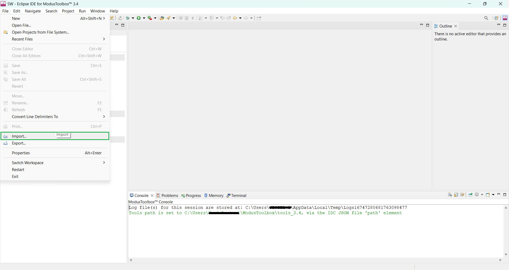
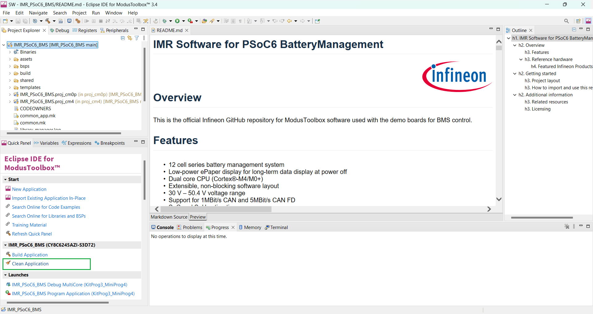
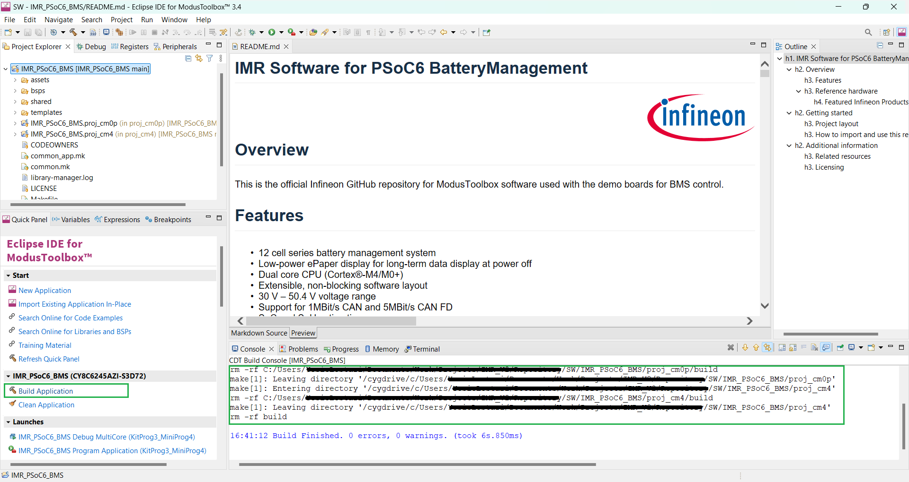

<!--
SPDX-FileCopyrightText: Copyright (c) 2024 Infineon Technologies AG
SPDX-License-Identifier: MIT
-->

# IMR Software for PSoC6 BatteryManagement

<a href="https://www.infineon.com">

</a>
<br>
<br>
<br>

## Overview

<p>This is the official Infineon GitHub repository for Modus Toolbox software used with the demo boards for BMS control.</p>

### Features

- 12 cell series battery management system
- Low-power ePaper display for long-term data display at power off
- Dual core CPU (Cortex®-M4/M0+)
- Extensible, non-blocking software layout
- 30 V – 50.4 V voltage range
- Support for 1MBit/s CAN and 5MBit/s CAN FD
- SoC and SoH estimation
- Balancing algorithm
- Precharge algorithm
- Hot-plug support
- Real-time data recording
- Extensive diagnostic system 
- Current, voltage and temperature threshold errors
- Open load diagnostics error monitoring
- Cell overvoltage or undervoltage check
- Balancing over- and undercurrent errors
- ADC cross-check error
- Internal overtemperature detection
- Register CRC check fault detection
- Internal peripheral error checks
- 16-bit measurement of voltages and current
- Five temperature measurement channels
- Low-power Flash technology,
- Programmable digital & analog resources
- Integrated buzzer

### Reference hardware

This software is meant to run on following reference hardware:
- [DEMO_IMR_BMSPWR - Demo board for BMS power](https://www.infineon.com/cms/en/product/evaluation-boards/demo_imr_bmspwr_v1/)
- [DEMO_IMR_BMSCTRL_V1 - Demo board for BMS control](https://www.infineon.com/cms/en/product/evaluation-boards/demo_imr_bmsctrl_v1/)

The system consists of a power board on which all measurement and power hardware is populated and an exchangeable main controller board.

#### Featured Infineon Products 
Following products are featured by the reference hardware:

| Product | Description |
| ---- | -------- |
| [CY8C6245AZI-S3D72](https://www.infineon.com/cms/en/product/microcontroller/32-bit-psoc-arm-cortex-microcontroller/psoc-6-32-bit-arm-cortex-m4-mcu/cy8c6245azi-s3d72/) | High-performance, low-power dual-core microprocessor |
| [2ED4820-EM](https://www.infineon.com/cms/de/product/power/gate-driver-ics/automotive-gate-driver-ics/2ed4820-em/) | 48 V smart high-side MOSFET gate driver |
| [TLE9012DQU](https://www.infineon.com/cms/de/product/battery-management-ics/tle9012dqu/) | Li-Ion battery monitoring and balancing analog frontend IC |
| [ILD8150](https://www.infineon.com/cms/de/product/power/lighting-ics/dc-dc-led-driver-ic/ild8150/) | High power 80V DC-DC converter IC |
| [IPT010N08NM5](https://www.infineon.com/cms/de/product/power/mosfet/n-channel/ipt010n08nm5/) | Single N-Channel OptiMOS™ 5 power MOSFET |
| [TLE9351BVSJ](https://www.infineon.com/cms/de/product/transceivers/automotive-transceiver/automotive-can-transceivers/tle9351bvsj/) | High speed CAN Transceiver for CAN and CAN-FD |
| [TLI4971-A025T5-E0001](https://www.infineon.com/cms/en/product/sensor/current-sensors/tli4971-a025t5-e0001/?redirId=140581) | Magnetic coreless current sensor with analog interface |
| [TLS205B0EJ V33](https://www.infineon.com/cms/de/product/power/linear-voltage-regulator/linear-voltage-regulators-for-automotive-applications/tls205b0ej-v33/) | Linear Voltage Post Regulator, Low Dropout, Low Noise, 3.3V |
| [TLS208D1EJV](https://www.infineon.com/cms/de/product/power/linear-voltage-regulator/linear-voltage-regulators-for-automotive-applications/tls208d1ejv/) | Linear Voltage Post Regulator, Low Dropout, Low Noise, adjustable |
| [BSD235N](https://www.infineon.com/cms/de/product/power/mosfet/small-signal-small-power/bsd235n/) | OptiMOS™2 N-Channel Small Signal MOSFET |
| [IRLML6401TRPBF](https://www.infineon.com/cms/de/product/power/mosfet/p-channel/irlml6401trpbf-1/) | 12V Single P-Channel Power MOSFET |
| [ISC035N10NM5LF2](https://www.infineon.com/cms/de/product/power/mosfet/n-channel/isc035n10nm5lf2/) | OptiMOS™ 5 Single N-Channel Linear FET |
| [CY15B256Q-SXA](https://www.infineon.com/cms/de/product/memories/f-ram-ferroelectric-ram/cy15b256q-sxa/) | 256-Kbit Automotive Serial (SPI) F-RAM |

## Getting started

### Project layout

This ModusToolbox project is split up into 2 subprojects, one for each processor:

```text
├── proj_cm4/                             # Sub-project for the main processor (main BMS functions)
|    ├── BMS_2ED4820EM/                   # Library for the safety switch of (intelligent gate driver)
|    ├── BMS_TLE9012/                     # Library for the analog frontend
|    ├── FRAM_DIRECT_SPI.c/               # Library for the FRAM memory IC
|    ├── main.c                           # Main code file for the main processor (main BMS functions)
|    ├── balancing.h/.c                   # Abstraction of battery balancing related functions 
|    ├── battery_state.h/.c               # Abstraction of battery state related algorithm (e.g. SoC & SoH)
|    ├── diagnostic.h/.c                  # Diagnostic subsystem
|    ├── global_management.h/.c           # Common elements between all components on CM4 core
|    ├── IMR_CAN.h/.c                     # CAN Communication (BMS specific)
|    ├── IMR_CAN_GLOBAL.h                 # Global definitions and IDs for CAN communication within IMR
|    ├── memory.h/.c                      # Abstraction of memory subsystem used for status and real-time data storage
|    ├── safety_switch.h/.c               # Abstraction of safety switch related functions
├── proj_cm0p/                            # Sub-project for the secondary processor (e.g. user interface and now priority tasks)
|    ├── main.c/                          # Main code file for the secondary processor (e.g. user interface and now priority tasks)
|    ├── PSoC6_BMS_EPD_ScreenConfig.h/.c  # Display and menu definition, configuration and design
├── LICENSE/                              # Licenses used in this project
```


### How to import and use this repository
<ol>
<li> Install and start Modus Toolbox and select a workspace to be used (tested with Version 3.1, 3.2, and 3.3).
<li> Import the project with the import wizard by pressing 'File' – 'Import…'. <br>
    <picture>
        
    </picture>
    <br>
    &nbsp;
</li>
<li> Select 'General' – 'Existing Project into Workspace' and press 'Next'. <br>
    <picture>
        
    </picture>
    <br>
    &nbsp;
</li>
<li> Select the archive file by pressing 'Browse…'. <br>
    <picture>
        
    </picture>
    <br>
    &nbsp;
</li>
<li> Deselect the subprojects - only the main project must be ticked. Press 'Finish'. <br>
    <picture>
        
    </picture>
    <br>
    &nbsp;
</li>
<li> Right click the 'proj_cm0p' folder and press 'Import as Project'. <br>
    <picture>
        
    </picture>
    <br>
    &nbsp;
</li>
<li> Right click the 'proj_cm4' folder and press 'Import as Project'6. <br>
    <picture>
        
    </picture>
    <br>
    &nbsp;
</li>
<li> Click on the main project item, wait a second until the quick view panel loads and start the 'Library Manager' on it. <br>
    <picture>
        
    </picture>
    <br>
    &nbsp;
</li>
<li> Press the 'Update' button <br>
    <picture>
        
    </picture>
    <br>
    &nbsp;
</li>
<li> If the update failed, try it again. If this also fails try to clean the project, before trying it again. <br>
    <picture>
        
    </picture>
    <picture>
        
    </picture>
    <picture>
        
    </picture>
    <br>
    &nbsp;
</li>
<li> It should now be possible to build the project without errors. <br>
    <picture>
        
    </picture>
    <br>
    &nbsp;
</li>
<li> To flash the project onto the hardware, connect the MiniProg4 Programming adapter using the 10-pin flat cable. <span style="color:red">Before the flashing can be started the 'Start' button on the BMS (right-most button as seen from the front) must be pressed AND HELD until the programming is finished!</span> Use the green play button on the bottom left - 'Quick Panel' - 'Launches' - 'IMR_SW_PSoC6_BatteryManagement Program Application (KitPro3_MiniProg4)' to initiate the process.<br>
    <picture>
        
    </picture>
    <br>
    &nbsp;
</li>
<li> OPTIONAL: If the debug UART is needed (status and debug messages from system) also connect the TX pin on the controller board to pin 8 of the MiniProg4 (see figure above). In ModusToolbox open a Terminal and select the COM port the Debugger is on:
    <picture>
        
    </picture>
    <picture>
        
    </picture>
    <br>
    &nbsp;
</li>
</ol>


## Additional information

Precise definition of the software and its features can be found in the close-to-code documentation on top of each file, at the specific function itself and in the software documentation.

### Related resources

- [Robotics development platform: Infineon Mobile Robot (IMR)](https://www.infineon.com/cms/de/applications/robotics/development-platform/)
- Software documentation (coming soon)

<!---
### Contact
In case of questions regarding this repository and its contents, refer to [MAINTAINERS.md](MAINTAINERS.md) for the contact details of this project's maintainers.
-->

### Licensing

Please see our [LICENSE](LICENSE) for copyright and license information.


<!---
## Intended use cases

<p>These examples can be used as a starting point for your project. They are meant to be used with DAVE 4.5.0</p>
-->


